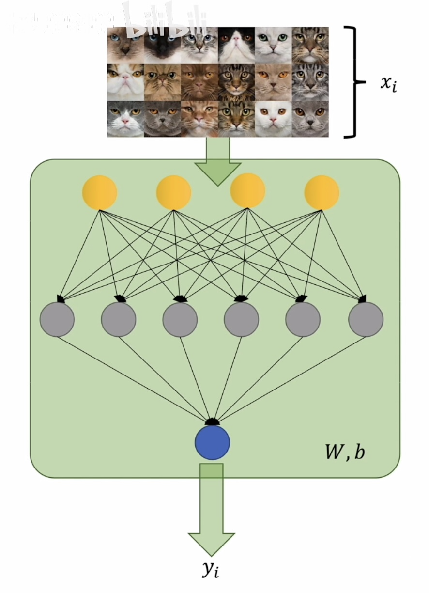
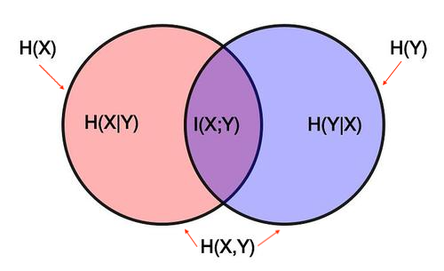

# 图对比学习 Graph Contrastive Learning

- 计算神经网络的损失函数有三个基本思路
  - 最小二乘法
  - 极大似然估计法
  - 交叉熵
    - 先将模型换成熵这么一个数值，然后利用这个数值去比较不同模型之间的差异

## 信息量 Amount of Information

- 小概率事件：带来的信息量很大

- 大概率事件：带来的信息量很小

- 信息量的大小不是看这个信息你知不知道，而是看他给你能带来多少确定性

- 独立的事件，信息量可相加

- $$
  I(x)=\log_2(\frac{1}{p(x)})=-\log_2(p(x))
  $$

## 香农熵 Shannon Entropy

- 熵在信息论中是对不确定性的测量，我们用熵来表示一个随机变量的信息量

  - 一个概率分布所包含的平均信息量就称为这个概率分布的熵

  - 概率分布的期望的平均信息量

  - $$ {离散事件概率分布的熵的公式}
    H(p)=\sum p_iI_i^p=\sum p_i\log_2(\frac{1}{p_i})=-\sum p_i\log_2(p_i)
    $$

  - $$ {连续事件概率分布的熵的公式}
    H(p)=\int p_iI_i^p=\int p_i\log_2(\frac{1}{p_i})=-\int p_i\log_2(p_i)
    $$

- 描述概率不确定性的方法

- 概率密度函数更加均匀（各个事件发生概率更接近），产生的随机变量的不确定性就更高，也就有更大的熵

- 概率密度函数更加聚拢（某个事件发生概率更更高），产生的随机变量的不确定性就更确定，也就有更小的熵

## 交叉熵 Cross Entropy

- 是Loss函数的一种(也称为损失函数或代价函数),用于描述模型预测值与真实值的差距大小 

- 描述了从估计概率分布的角度对真实概率分布的平均信息量的一个估计值

- q：对各事件发生的的概率的估计(估计出来的概率分布)，可看作是猜测的且待修正的

- p：是真实的概率分布，可看作通过抽样得到的

- 给定q，对真实概率分布p的平均信息量的估计叫做交叉熵

- 期望是通过真值的概率分布p来求的

  - 事件总是以真实的概率分布区发生

- 信息量的计算以估计出来的概率分布q来计算的

  - 我们只能看到估计出来的概率分布

- $$
  H(p,q)=\sum p_iI_i^q=\sum p_i\log_2(\frac{1}{q_i})=-\sum p_i\log_2(q_i)
  $$

  在神经网络中利用交叉熵：$\sum_{i=1}^m$(m是两个系统中事件数量更大的那个事件数)
  
  以训练模型判断照片是否为猫咪为例：
  ($x_i$只有两种情况，要么是猫，要么不是猫；$y_i$是在判断这个猫有多像猫)
  
  $P$是作为基准，是要被比较的概率模型(人脑)
  $$
  \begin{align}
  H(P,Q)
  	& = \sum_{i=1}^mp_i(-\log_2q_i)\\
  	& = \sum_{i=1}^np_i(-\log_2q_i)~把m换成n(训练时用的照片的数量)\\
  	& = -\sum_{i=1}^n(x_i·\log_2y_i+(1-x_i)·\log_2(1-y_i)~与极大似然估计法推出来的式子一样\\
  \end{align}
  $$

当$x_i=1$人脑判断是猫的时候，神经网络给出来是猫的概率$y_i$是多少;
当$(1-x_i)=1$人脑判断不是猫的时候，神经网络给出来不是猫的概率$(1-y_i)$是多少

## KL散度 Kullback–Leibler divergence

- 量化地去衡量两个概率分布的区别的函数，定量描述了两个概率分布之间的区别

- 一个概率模型中的重要基础概念，对推导模型的损失函数(如交叉熵损失函数)有着重要的意义

- KL散度=交叉熵 - 熵

- $$
  \begin{align}
  D(p||q)
  &=H(p,q)-H(p)\\
  &=\sum p_iI_i^q-\sum p_iI_i^p\\
  &=\sum p_i\log_2(\frac{1}{q_i})-\sum p_i\log_2(\frac{1}{p_i})\\
  &=-\sum p_i\log_2(\frac{p_i}{q_i})
  \end{align}
  $$
  
- $D(p||q)\geq0$且只有当两个概率分布完全一致的时候KL散度才会=0
  
- $D(p||q)\neq D(q||p)$KL散度不是距离的衡量
  
- 优化模型需要最小化KL散度

- $$ {最小化KL散度}
  \nabla_\theta D(p||q_\theta)=\nabla_\theta H(p,q_\theta)-\nabla_\theta H(p)=\nabla_\theta H(p,q_\theta)
  $$

  ​                                                                                          其中$\nabla$是求梯度，$\theta$是参数
  
  ​                                                                  又因为$p$是真实的概率分布，与$\theta$无关，所以$\nabla_\theta H(p)=0$

- 为了衡量两个概率分布的区别，一个直观的想法是基于概率分布p来采样一个随机数序列，然后分别求这个序列在给定概率分布p下的一个概率，和给定概率分布q下发生的一个概率。再将这两个值做一个比较，如果比较相近，则说明这两个概率分布是比较相近的；反之则相差较远
  $$
  D(p||q)=\sum p_i\log_2(\frac{p_i}{q_i})=\log(\frac{P(sequence~~of~~distribution~~p~|~distribution~~p)}{P(sequence~~of~~distribution~~p~|~distribution~~q)})
  $$
  

## 互信息 Mutual Information

- 两个随机变量的互信息是指变量间相互依赖的量度
- 互信息度量的是两个随机变量共享的信息
  - 知道随机变量X，对随机变量Y的不确定性减少的程度(或者知道Y后X的不确定性的减少)，用I(X;Y)表示
  - 例子：若X表示骰子掷出的点数，Y 表示X的奇偶性(当X为偶数时Y=0，当X为奇数时Y=1)。
    - 如果知道X：假设X=1，则可与判断Y=1(失去了Y=0这一信息的可能性)
    - 如果知道Y：假设Y=0，则可以判断X为偶数(失去了X=1, 3, 5 的可能性)

​			   所以可以说随机变量X、Y间存在互信息

- $$
  I(X;Y)=H(X)-H(X|Y)=H(Y)-H(Y|X)=H(X)+H(Y)-H(X,Y)
  $$

​																 互信息=随机变量X的不确定性 - 在知道随机变量Y之后X的不确定性

- $$
  I(X;Y)=\sum_{x,y}p(x,y)\log_2(\frac{p(x,y)}{p(x)p(y)})
  $$

- 如果X、Y互为确定性函数(知道X决定Y的值，反之亦然)，那么二者的互信息与它们的熵相同:
  $$
  I(X,Y)=1=H(X)=H(Y)
  $$
  
- 两个相互独立的变量之间的互信息为0
- log的底数为2是因为我们用比特作为单位度量信息，每个比特可以表示两个数字